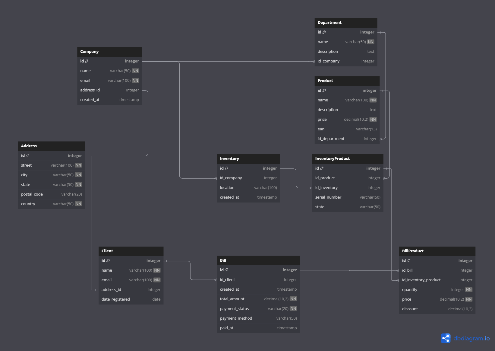

# **StoreManager API**

**StoreManager API** es una API RESTful desarrollada en **TypeScript** utilizando **Express**, creada para optimizar la gestión de tiendas físicas. Esta API permite a las empresas manejar de manera eficiente sus operaciones diarias, incluyendo la administración de **clientes**, **productos**, **facturación** y el control del **inventario**. Está diseñada con un enfoque en la escalabilidad y flexibilidad, permitiendo que se amplíe fácilmente con nuevas funcionalidades a medida que crece el negocio.

### **Características principales**

- **Gestión de Clientes**: Implementa operaciones CRUD (Crear, Leer, Actualizar, Eliminar) para almacenar y actualizar la información de los clientes.
- **Gestión de Productos**: Permite registrar productos con control de precios, inventario y descripciones detalladas.
- **Facturación**: Crea y almacena facturas, incluyendo detalles de los productos adquiridos por cada cliente.
- **Control de Inventario**: Realiza un seguimiento del stock de productos, actualizándose automáticamente tras cada venta.
- **Escalabilidad**: Arquitectura modular y adaptable, preparada para añadir funcionalidades como descuentos, generación de reportes y autenticación de usuarios.

### **Tecnologías utilizadas**

- **Node.js** con **Express** para la creación del servidor.
- **TypeScript** para garantizar un código más robusto, mantenible y escalable.
- **PostgreSQL** como sistema de base de datos relacional (adaptable a otros sistemas de bases de datos).
- **pg** para gestionar las conexiones con la base de datos, de manera similar a **JDBC** en Java.

### **Motivación del Proyecto**

Este proyecto sigue una arquitectura inspirada en cómo se trabajaría en **Java** con **JDBC**, pero ha sido desarrollado en **TypeScript** para aprovechar las ventajas de este lenguaje moderno y versátil, además de fomentar el aprendizaje y la confianza en la adaptación a nuevos lenguajes de programación.

> Aún es posible que todo el proyecto no este orientado a **JBDC** y que cuando se extienda el proyecto se pueda implementar algún **ORM**.

El objetivo es proporcionar una solución ideal para **pequeñas y medianas empresas** que necesiten un sistema centralizado para gestionar sus tiendas físicas, permitiendo una **visión en tiempo real** del estado de ventas, inventario y relación con los clientes.

## **Esquema SQL**

> Puedes encontrar en la ruta `docs/sql` todos los script que se ha ido generando en el proyecto. De esa manera puede replicarlo tu mismo en tu proyecto.